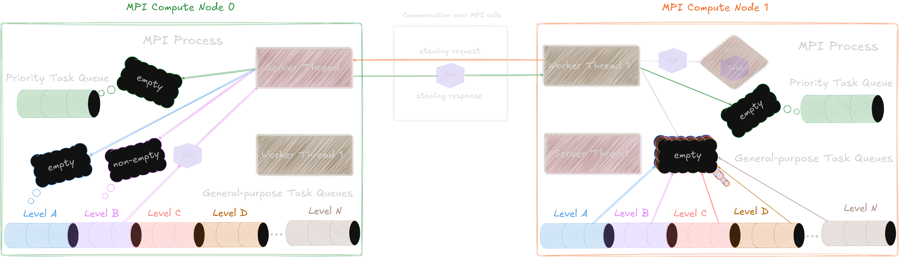
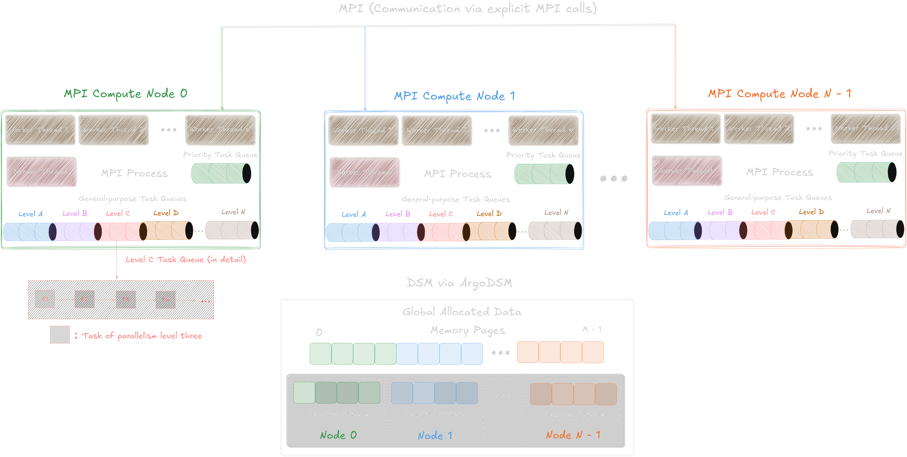

# torcjulia: Supporting hybrid task-based parallelism in Julia 🚀 
[](https://julialang.org) 


**torcjulia** is a **high-level**, **platform-agnostic**, and **adaptive load balancing** framework for efficient and flexible **hybrid task parallelism** in Julia. Built on top of **MPI** and **Julia's multithreading**, torcjulia supports both shared and distributed memory systems. Inspired by Python’s [concurrent.futures][concurrent-futures-link] module, its modern and intuitive API allows engineers from diverse fields (e.g., Data Science, Machine Learning) to easily leverage Julia’s parallelism, scaling seamlessly from a single workstation to clusters and supercomputers.

## Table of Contents
* [About](#about)
  * [Task Parallelism](#task-parallelism)
  * [torcjulia](#torcjulia)
* [Installation, Usage and Testing](#installation-usage-and-testing)
  * [Installation](#installation)
  * [Usage](#usage)
  * [Testing](#testing)
* [Architecture](#architecture)
  * [Task Queues](#task-queues)
  * [Task Distribution, Server Thread and Task Stealing Mechanism](#task-distribution-server-thread-and-task-stealing-mechanism)
  * [Task Assignment Policy](#task-assignment-policy)
* [Application Programming Interface (API)](#application-programming-interface-api)
  * [Runtime Engine Setup](#runtime-engine-setup)
  * [Environmental Variables](#environment-variables)
  * [Low-level Application Setup](#low-level-application-setup)
  * [Task Management Routines](#task-management-routines)
  * [SIMD Programming Model with MPI](#simd-programming-model-with-mpi)
  * [Parallel Algorithmic Skeletons](#parallel-algorithmic-skeletons)
  * [Auxiliary Functions](#auxiliary-functions)
* [Examples](#examples)
  * [Submit and Wait](#submit-and-wait)
  * [Parallel Map](#parallel-map)
  * [Parallel Asynchronous Map](#parallel-asynchronous-map)
  * [Parallel Starmap](#parallel-starmap)
  * [Parallel Asynchronous Starmap](#parallel-asynchronous-starmap)
  * [Callback](#callback)
  * [Task Dependencies](#task-dependencies)
  * [Τask Priorities](#task-priorities)
  * [Multi-level (Nested) Parallelism](#multi-level-nested-parallelism)
  * [Calling MPI SPMD code: MPI_Bcast](#calling-mpi-spmd-code-mpi_bcast)
  * [Reduction Operation using Callbacks](#reduction-operation-using-callbacks)
  * [Work Stealing Mechanism](#work-stealing-mechanism)
  * [Parallel Filter](#parallel-filter)
  * [Parallel Reduce](#parallel-reduce)
  * [Parallel MapReduce](#parallel-mapreduce)
  * [Parallel MapPairs](#parallel-mappairs)
  * [Parallel MapPairsReduce](#parallel-mappairsreduce)
  * [Parallel Scan](#parallel-scan)


## About

### Task Parallelism
With silicon semiconductor technology nearing its physical limits, the increasing demand for processing power has made multicore processors the de facto standard. In this context, **task-based parallelism** has been established as one of the two primary paradigms for code parallelization, where asynchronous tasks, either completely decoupled or part of an algorithm, regular or irregular, are launched at different levels of parallelism and distributed across the available processing units of a local machine, a cluster, or a supercomputer. 

The runtime task scheduler is responsible for assigning spawned tasks to these units, allowing programmers to focus on expressing the **inherent parallelism** of algorithms without needing to consider the underlying hardware details. Therefore, as hardware and software heterogeneity increases in modern parallel computing platforms, task parallelism, and more specifally **nested fork-join parallelism**, provides a simple and intuitive way to express **dynamic parallelism at a fine-grained level** across their hierarchical architectures, making it particularly well-suited for heterogeneous workloads.

Typical use cases for task-based parallelism include:

- Applying the same function to different data
- Parametric and grid searching (e.g., hyperparameter tuning in ML)
- Algorithms in numerical optimization and Bayesian uncertainty quantification
- Monte Carlo simulations and ensemble-based computations
- Parallel data fetching and preprocessing of large-scale image, video, or tabular datasets
- Real-time data analytics and streaming computations

### torcjulia
The proposed framework, **torcjulia**, constitutes a **platform-agnostic**, **adaptive load balancing** library that orchestrates the scheduling of tasks on both **shared and distributed memory platforms**, adopting a **hybrid multi-level nested paralllelism scheme**. Unlike *Dagger.jl*, which is built on the Distributed module, *torcjulia* is implemented on top of the [MPI.jl][MPI.jl-link] package, the standard Julia wrapper for the portable MPI message passing system. For multithreading, it leverages the capabilities provided by Julia’s [Threads][Threads-link] submodule. To our knowledge, *torcjulia* is the first task-based engine written entirely in Julia, built on top of MPI, that supports **hybrid parallelism** and offers a **Pythonic API** inspired by established frameworks.

In contrast to *Dagger.jl*, which is primarily intended for general-purpose, task-based parallelism, *torcjulia* targets **HPC workloads** and **tightly coupled applications** running on clusters and supercomputers. Rather than replacing *Dagger.jl*, our aim is to **broaden Julia’s HPC ecosystem** by offering a runtime that is both **platform- and language-agnostic**. Specifically, Julia serves as a high-level, expressive frontend to this HPC substrate, while the underlying MPI-based engine can, in principle, be reused by other languages or environments.

The key features of the proposed task-based runtime system are as follows:

- Offers a unified approach for expressing and executing hybrid task-based parallelism on both shared and distributed memory platforms, including clusters and supercomputers

- Supports lightweight multi-level nested parallelism

- Employs a sequential programming model, allowing developers to write straightforward Julia code annotated for asynchronous parallel tasks

- Implements a fully symmetric, P2P task execution model in which all ranks can both produce and consume tasks, with no need for a dedicated master process

- Supports both task pinning and task prioritization, enabling tasks to be executed according to user-defined requirements

- Supports adaptive load balancing via inter-node work stealing at all levels of parallelism, inspired by state-of-the-art distributed task runtimes

- Supports a wide range of parallel algorithmic skeletons

- Takes advantage of MPI internally in a transparent to the user way but also allows the use of legacy MPI code at the application level

- Automatically detects and handles data dependencies between tasks 

- Provides high-level functions that enable the use of software-distributed shared memory (S-DSM) at the application level

- Allows direct switching to the typical SPMD execution mode that is natively supported by MPI

- Adopts a Python-like API similar to that of [Python Enhancement Proposal (PEP) 3148][PEP3148-link], allowing tasks to be spawned and joined with the submit and wait calls 

## Installation and Usage

### Installation 

Prerequisites: **Julia 1.11** or newer

Begin by cloning the repository to your local machine and navigate to project's root folder:
```bash
git clone https://github.com/Sofosss/torcjulia_dev && cd torcjulia_dev
``` 

Now, dependencies of *torcjulia* can be installed using the Julia package manager. Enter the Pkg REPL mode by typing "]" in the Julia REPL and then run:
```julia
pkg> activate .
pkg> develop ./torcjulia
pkg> instantiate
```

### Usage

Once installed, *torcjulia* can be loaded using:

```julia
using torcjulia
```

Run the follow simple example to become familiar with how *torcjulia* exposes task-based parallelism:

```julia
using torcjulia

function add1(x::Int)
    x + 1
end

function add2(f::torcjulia.TorcTask)
    torcjulia.result(f) + 2
end

function compute_sum(f1::torcjulia.TorcTask, f2::torcjulia.TorcTask, f3::torcjulia.TorcTask)
    torcjulia.result(f1) + torcjulia.result(f2) + torcjulia.result(f3)
end

function main()
    init_value = 5

    future_1 = torcjulia.submit(add1, init_value)

    # future_2 depends on future_1. Therefore, future_2 will only execute after future_1 is completed
    future_2 = torcjulia.submit(add2, future_1)

    future_3 = torcjulia.submit(add1, init_value - 1)

    # future_4 depends on future_1, future_2 and future_3. It will execute after all three tasks are completed
    future_4 = torcjulia.submit(compute_sum, future_1, future_2, future_3)

    # wait for future_4 to complete
    torcjulia.wait([future_4])

    println("Total sum: $(torcjulia.result(future_4))") # Total sum -> 6 + 8 + 5 = 19
end

torcjulia.init(main)
```
>[!NOTE]
> As mentioned above, *torcjulia* is built on top of MPI. Since MPI.jl can be configured to use different MPI implementations across projects, it can sometimes be unclear which mpiexec executable is associated with a specific Julia environment. To simplify this, on Unix-based systems, MPI.jl provides a project-aware wrapper called `mpiexecjl`. We recommend installing `mpiexecjl` (`via MPI.install_mpiexecjl()`) and adding its installation directory to your `PATH`. This allows you to launch your scripts with the correct MPI version for each project by simply using `mpiexecjl` instead of `mpiexec`.

>[!IMPORTANT] 
> When using *torcjulia* with multiple MPI processes (i.e., in distributed computing mode), one thread in each process acts as a server thread and does not perform work (see [Architecture](#architecture)). As a result, whenever you launch with `MPI.NUM_PROCS` > 1, each process must have at least two threads. In practice, this means you should set the `-t/--threads` command-line argument or the `JULIA_NUM_THREADS` environment variable to a value of 2 or greater for each process.

### Testing
We use the file [master_worker.jl](./examples/julia/examples/master_worker.jl) to demonstrate the execution of the tasking library with multiple processes and threads. The task function takes an input value `x`, sleeps for one second, computes the square of `x`, and returns the result. The main task spawns `n_tasks` (8) tasks, which are distributed to the available workers in a round-robin fashion by default, and then calls `wait` to block until all tasks have completed. Finally, it prints the results and reports the elapsed time.

Calling `torcjulia.init(main)` initializes the tasking library and runs the main application task (`main()`) on the master process (MPI rank 0).

```julia
using torcjulia

function work(x)
    sleep(1)
    y = x^2

    println("work inp = $(round(x, digits = 3)), out = $(round(y, digits = 3)) \
             on node $(torcjulia.node_id()) worker $(torcjulia.worker_id())")
    y
end

function main()
    ntasks = 8; inputs = 1:ntasks

    t0 = time_ns() * 1e-9

    tasks = [torcjulia.submit(work, x) for x in inputs]
    torcjulia.wait(tasks)

    elapsed = time_ns() * 1e-9 - t0

    for (i, task) in enumerate(tasks)
        x = inputs[i]; y = torcjulia.result(task)
        println("res: $x^2 = $y")
    end

    println("total time: $(round(elapsed, digits = 3))")
end

torcjulia.init(main)
```

#### ➛ 1 MPI Process with 1 Worker Thread
This is similar to sequential execution, except that task functions are executed in deferred mode. No MPI communication occurs; tasks are placed directly into the local queue. When `torcjulia.wait()` is called, the main task suspends, the worker scheduling loop begins, and child tasks are executed. Once all child tasks finish, the main task resumes and prints the results.

```console
$ mpiexecjl -np 1 julia --project=/path/to/torcjulia/project --threads 1 master_worker.jl 
torcjulia: main starts
work inp = 1.0, out = 1.0 on node 0 worker 1
work inp = 2.0, out = 4.0 on node 0 worker 1
work inp = 3.0, out = 9.0 on node 0 worker 1
work inp = 4.0, out = 16.0 on node 0 worker 1
work inp = 5.0, out = 25.0 on node 0 worker 1
work inp = 6.0, out = 36.0 on node 0 worker 1
work inp = 7.0, out = 49.0 on node 0 worker 1
work inp = 8.0, out = 64.0 on node 0 worker 1
res: 1^2 = 1
res: 2^2 = 4
res: 3^2 = 9
res: 4^2 = 16
res: 5^2 = 25
res: 6^2 = 36
res: 7^2 = 49
res: 8^2 = 64
total time: 8.438
torcjulia: node[0]: created=8, executed=8, stole=0, stolen=0, steal_attempts=0, max_queue_depth=1
torcjulia [tasks]: average pending time=3.627 s, average execution time=1.008 s
```

#### ➛ 1 MPI Processes with 2 Worker Threads
The MPI process is initialized with two worker threads. The tasks are inserted in the local process queue and extracted and executed by the two workers.

```console
$ mpiexecjl -np 1 julia --project=/path/to/torcjulia/project --threads 2 master_worker.jl 
torcjulia: main starts
work inp = 1.0, out = 1.0 on node 0 worker 2
work inp = 2.0, out = 4.0 on node 0 worker 1
work inp = 4.0, out = 16.0 on node 0 worker 1
work inp = 3.0, out = 9.0 on node 0 worker 2
work inp = 5.0, out = 25.0 on node 0 worker 1
work inp = 6.0, out = 36.0 on node 0 worker 2
work inp = 8.0, out = 64.0 on node 0 worker 2
work inp = 7.0, out = 49.0 on node 0 worker 1
res: 1^2 = 1
res: 2^2 = 4
res: 3^2 = 9
res: 4^2 = 16
res: 5^2 = 25
res: 6^2 = 36
res: 7^2 = 49
res: 8^2 = 64
total time: 4.437
torcjulia: node[0]: created=8, executed=8, stole=0, stolen=0, steal_attempts=0, max_queue_depth=1
torcjulia [tasks]: average pending time=1.592 s, average execution time=1.012 s
```

#### ➛ 2 MPI Processes with 1 Worker Thread each
Two MPI processes are started, each with one worker thread and one server thread (hence --threads == 2). The primary task runs on rank 0 and spawns the tasks. These tasks are then assigned cyclically to the worker threads.

```console
$ mpiexecjl -np 2 julia --project=/path/to/torcjulia/project --threads 2 master_worker.jl 
torcjulia: main starts
work inp = 1.0, out = 1.0 on node 0 worker 1
work inp = 2.0, out = 4.0 on node 1 worker 2
work inp = 3.0, out = 9.0 on node 0 worker 1
work inp = 4.0, out = 16.0 on node 1 worker 2
work inp = 5.0, out = 25.0 on node 0 worker 1
work inp = 6.0, out = 36.0 on node 1 worker 2
work inp = 7.0, out = 49.0 on node 0 worker 1
work inp = 8.0, out = 64.0 on node 1 worker 2
res: 1^2 = 1
res: 2^2 = 4
res: 3^2 = 9
res: 4^2 = 16
res: 5^2 = 25
res: 6^2 = 36
res: 7^2 = 49
res: 8^2 = 64
total time: 4.448
torcjulia: node[0]: created=8, executed=4, stole=0, stolen=0, steal_attempts=0, max_queue_depth=1
torcjulia: node[1]: created=0, executed=4, stole=0, stolen=0, steal_attempts=0, max_queue_depth=0
torcjulia [tasks]: average pending time=1.650 s, average execution time=1.008 s
```
>[!NOTE]
> In contrast to *Dagger.jl* and the *Distributed* module, note that the main process is switched to a worker and actively participates in task processing.

#### ➛ 2 MPI Processes with 2 Worker Threads each (hybrid parallelism)
There are two MPI processes, each with two worker threads. Thus, workers 1 and 2 belong to the process with rank 0, and workers 3 and 4 to rank 1. Since task distribution is performed on a per-worker basis, the first four tasks are assigned locally to node 0, while the next four are sent to node 1. As a result, each worker executes two tasks instead of eight (sequential approach), achieving approximately 4× speedup with uniform task granularity.

```console
$ mpiexecjl -np 2 julia --project=/path/to/torcjulia/project --threads 3 master_worker.jl 
torcjulia: main starts
work inp = 1.0, out = 1.0 on node 0 worker 2
work inp = 2.0, out = 4.0 on node 0 worker 1
work inp = 4.0, out = 16.0 on node 1 worker 4
work inp = 3.0, out = 9.0 on node 1 worker 3
work inp = 5.0, out = 25.0 on node 0 worker 2
work inp = 6.0, out = 36.0 on node 0 worker 1
work inp = 7.0, out = 49.0 on node 1 worker 4
work inp = 8.0, out = 64.0 on node 1 worker 3
res: 1^2 = 1
res: 2^2 = 4
res: 3^2 = 9
res: 4^2 = 16
res: 5^2 = 25
res: 6^2 = 36
res: 7^2 = 49
res: 8^2 = 64
total time: 2.467
torcjulia: node[0]: created=8, executed=4, stole=0, stolen=0, steal_attempts=0, max_queue_depth=1
torcjulia: node[1]: created=0, executed=4, stole=0, stolen=0, steal_attempts=0, max_queue_depth=0
torcjulia [tasks]: average pending time=0.613 s, average execution time=1.012 s
```
## Architecture
As previously mentioned, the task-based engine of *torcjulia* is designed to support **hybrid parallelism** and relies on three key Julia modules: (a) [MPI][MPI.jl-link], (b) [Threads][Threads-link], and (c) [ConcurrentCollections][ConcurrentCollections-link]. As a result, a typical *torcjulia*-based application consists of multiple MPI processes, each hosting one or more Julia worker threads. The result of a task is transparently stored in the task descriptor (*future*) on the MPI process that spawned the task. According to **PEP 3184**, the result can be then accessed as `result(task)`. Similarly, the positional and keyword arguments can be accessed using `input(task)` and `kw_input(task)`, respectively.

### Task Queues

- Each MPI process maintains several **general-purpose queues**, where non-priority tasks are inserted according to the **level of parallelism they are spawned from**, and one **priority queue**. Worker threads extract tasks from these queues, always respecting task priorities. General-purpose tasks at the same level are scheduled in **FIFO** order, whereas tasks from higher levels (*coarse-grained* tasks) are prioritized across levels. All queues are implemented using data structures from the *ConcurrentCollections* module, ensuring **thread safety**.

### Task Distribution, Server Thread and Task Stealing Mechanism

- Spawned tasks are distributed to workers following a **round-robin** scheduling policy.

- All remote operations related to task and data management are performed with explicit, but completely transparent to the user, messages to a dedicated thread, utilized by each MPI process, called **server**. This thread runs **asynchronously**, taking care of all **communication and coordination** for the process. Its responsibilities include:

  - Inserting tasks received from other processes into the appropriate local queues
  - Receiving completed tasks along with their results
  - Handling incoming task-stealing requests and returning available tasks when possible

  If the application runs as a pure multithreaded code then all operations are performed exclusively through shared memory and as a result **no sever thread is utilized**.

- The **main thread of each process** (including the master process) also **participates in task execution** (**P2P model**). This approach distinguishes *torcjulia* from Julia’s two primary engines for distributed computing: the built-in *Distributed* module and the *Dagger.jl* package, both of which employ a **manager–worker** paradigm.

- During task submission and assignment, *torcjulia* uses an **internal mechanism to detect task-level dependencies** and dynamically adapts scheduling to: (a) maximize **worker utilization** and (b) satisfy all **dependencies**.

- To efficiently support *irregular workloads*, *torcjulia* implements **task stealing**, enabling **adaptive load balancing** based on the computational cost of submitted tasks. This mechanism helps maintain an even workload distribution and **minimizes idle time**, even under highly irregular scenarios, a common scenario in optimization algorithms. The task-stealing policy always favors high-priority tasks when available.

### Task Assignment Policy

An idle worker always tries first to extract work from the **local priority queue**. If no tasks are available, it proceeds to the **highest-level** non-empty general queue. If no work is found locally, the worker attempts to steal tasks from remote queues. Specifically, it sends a synchronous stealing request to the server thread of the next, according to the rank, MPI process and continues until an available task has been returned or all processes have been accessed. 

The server thread search for work starting from local priority queue. If no work, found, it starts search for work from the **highest-level** local queue, i.e. for tasks at the outermost level of parallelism. As mentioned above, the default task spawning policy distributes first-level tasks cyclically among the workers and submits inner-level tasks locally. Combined with task stealing, this policy favors **stealing of coarse-grain** tasks and **local execution of deeper levels of parallelism**.

</br>

*Figure 1* illustrates the **task-stealing mechanism** in *torcjulia* using a simple example with **two** MPI processes, each with a single worker thread.

</br>
<p align="center">
  <picture>
    <source srcset = "./doc/figures/task_stealing.png" media = "(prefers-color-scheme: dark)">
    <source srcset = "./doc/figures/task_stealing_light.png" media = "(prefers-color-scheme: light)">
    
  </picture>
  <br>
  <em><i>Figure 1: Task-stealing mechanism in torcjulia</i></em>
</p>

</br>

The worker thread of the process with **MPI rank 1** becomes idle and starts looking for work. It first inspects its local priority queue, which is empty. It then scans its general-purpose task queues, from the highest (A) to the lowest level (N), but finds them all empty.

Since no local tasks are pending, the worker thread sends a task-stealing request via MPI to the **server thread** of the **process with MPI rank 0**. The server thread checks its node priority queue, which is also empty, then scans its general-purpose task queues, beginning from the highest level. The first queue is empty, but the second-level queue contains a **pending task**. The server thread removes this task and sends it via MPI to the worker thread in the rank 1 process, which then executes it. 

The internal architecture of the *torcjulia* task-based engine is illustrated in the following figure:

</br></br>
<p align="center">
  <picture>
    <source srcset = "./doc/figures/architecture.png" media = "(prefers-color-scheme: dark)">
    <source srcset = "./doc/figures/architecture_light.png" media = "(prefers-color-scheme: light)">
    
  </picture>
  <br>
  <em><i>Figure 3: Architecture of torcjulia</i></em>
</p>

## Application Programming Interface (API)

### Runtime Engine Setup

- `init(func; MPI_finalize = true)`: Initializes the runtime engine and launches `func` as the primary application task on the MPI process with rank 0. When `func()` completes, the runtime engine is shut down. If the boolean parameter `MPI_finalize` is `true` (default), the underlying MPI environment is finalized as well; otherwise, MPI remains active. This design allows the library to be started and stopped multiple times within a single application without problems.

### Environment Variables

- `TORC_STEALING`: `Bool` parameter that controls whether task stealing between nodes is enabled. The default value is `false`.

- `TORC_SERVER_YIELDTIME`: `Float64` parameter specifying how many seconds an idle server thread will sleep, releasing the corresponding processor. Default value is `0.01`.

- `TORC_WORKER_YIELDTIME`: `Float64` parameter specifying how many seconds an idle worker thread will sleep, releasing the corresponding processor. Default value is `0.01`.

###  Low-level Application Setup

- `init()`: Initializes the task-based runtime engine.

- `launch(func)`: Launches the function `func` as the primary application task on the MPI process with rank 0. This is a collective operation that must be invoked by all MPI processes.

- `finalize(MPI_finalize)`: Shuts down the runtime engine and, if the boolean parameter `MPI_finalize` is `true`, also finalizes the MPI environment.

### Task Management Routines

- `submit(func, args...; qid = -1, callback = nothing, async_callback = true, counted = true, forced_node = false, priority = TaskPriority.low, kwargs...)`: Submits a new task for asynchronous execution of the function `func` with the given positional (`args`) and keyword (`kwargs`) arguments. The task is assigned to the node with MPI rank `qid`. If qid is set to -1, tasks are distributed **cyclically** across all processes.
  - The optional `callback` function is invoked on the rank that submitted the task when the task completes and its results are available. Depending on the value of `async_callback`, the callback is either executed **immediately** (`true`) or scheduled for **asynchronous execution** (`false`).
  - The boolean parameter `counted` determines whether the submitted task is included in the runtime statistics maintained by *torcjulia*.
  - The `forced_node` parameter controls whether a task, once assigned to a node, can be stolen by a worker from another node. By default, this is set to `false`, allowing task stealing across nodes.
  - The `priority` parameter sets the priority of the submitted task (**low**, **medium**, or **high**) as in [Kokkos][Kokkos-link]. The default is low, meaning the task has no special priority.

- `wait(tasks = nothing; return_completed = false)`: The current task waits for the completion of the specified (child) tasks (a vector of `TorcTask` objects). If `tasks` is not provided, waits for all its child tasks to finish. While waiting, the underlying worker thread is released and may execute other tasks (see [Architecture](#architecture)). If `return_completed` is `true`, returns a vector with the completed tasks.

### SIMD Programming Model with MPI

- `spmd(func, args...; counted = true, return_completed = true, kwargs...)`: Executes function `func` with the given positional (`args`) and keyword (`kwargs`) arguments on all MPI processes. It allows for dynamic switching from the master-worker to the SPMD execution mode, allowing thus legacy MPI code to be used within the function. Therefore, the use of *torcjulia’s* runtime engine does not preclude running the traditional SPMD model of MPI. 
  - The boolean parameter `counted` determines whether the spawned tasks are tracked in runtime statistics.
  - The boolean parameter `return_completed` specifies whether to return the list of completed tasks after execution.


### Parallel Algorithmic Skeletons

- `map(func, iterables...; chunksize = nothing, qid = -1, counted = true, forced_node = false, priority = TaskPriority.low, args = (), kwargs...)`: Parallel version of map that applies `func` with the given positional (`args`) and keyword (`kwargs`) arguments to elements from one or more input `iterables` (e.g., arrays, ranges, or any iterable collection). When multiple `iterables` are provided, `func` is applied to tuples of corresponding elements, just like the built-in Julia [map][Julia-map-link] and Python [map][Python-map-link]. 
  - Returns a vector with the results of all tasks.
  - The `chunksize` parameter sets the number of elements assigned to each task. If set to `nothing`, the chunk size is automatically determined as the total number of elements divided by the number of available workers.
  - The `qid` parameter specifies the target MPI node; by default, tasks are distributed in a round-robin fashion.
  - The boolean parameter `counted` determines whether spawned tasks are tracked in runtime statistics.
  -  The `forced_node` parameter pins tasks to the specified qid, preventing them from being stolen by other nodes.
  - The `priority` parameter sets the priority of the submitted tasks.

>[!NOTE]
> For the remaining algorithmic skeletons, input parameters that are identical to those described here are not discussed in detail.

- `starmap(func, iterable; chunksize = nothing, qid = -1, counted = true, forced_node = false, priority = TaskPriority.low, args = (), kwargs...)`: Parallel version of Python's [itertools.starmap][starmap-link], applying `func` to each element of `iterable` by unpacking its contents as arguments to `func`. Returns a vector with the results of all tasks.

- `map_async(func, iterables...; chunksize = nothing, qid = -1, counted = true, forced_node = false, priority = TaskPriority.low, callback = nothing, args = (), kwargs...)`: Applies `func` to each element of the zipped `iterables` asynchronously (similar to Python's [multiprocessing][multiprocessing-link].Pool.**map_async**).
  - Returns an `AsyncResult` object. The `ready` and `get` methods allow you to monitor task progress and retrieve results, following the interface of the corresponding [Python functions][AsyncResult-link]. 
  - The `callback` function (default: `nothing`), if provided, is invoked with the results after all tasks have completed.

- `starmap_async(func, iterable; chunksize = nothing, qid = -1, counted = true, forced_node = false, priority = TaskPriority.low, callback = nothing, args = (), kwargs...)`: Similar to `map_async`, but expects an iterable of argument tuples and applies `func` to each tuple (as in Python's [multiprocessing][multiprocessing-link].Pool.**starmap_async**). Returns an `AsyncResult` object.

- `reduce(func, data; chunksize = nothing, direction = :column, mode = "1d", qid = -1, counted = true, forced_node = false, priority = TaskPriority.low, args = (), kwargs...)`: Parallel associative reduction (using the associative function `func`) across the elements of a vector or matrix. It is similar to the [reduce][julia-reduce-link] function of Julia. Supports both 1D and 2D reductions. 
  - The `direction` parameter selects the axis for reduction in matrices (:column for column-wise, :row for row-wise). used only for "1d" reductions.
  - The `mode` parameter determines the output for matrices: "1d" reduces along the specified axis and returns a vector, while "2d" reduces across both axes and returns a scalar.

- `mapReduce(map_func, reduce_func, iterables...; chunksize = nothing, direction = :column, mode = "1d", qid = -1, counted = true, forced_node = false, priority = TaskPriority.low, args = (), kwargs...)`: Parallel map-reduce operation: applies `map_func` to `iterables` and then reduces the results with `reduce_func`, supporting both 1D (column-, or row-wise) and 2D reductions. It is similar to the [mapreduce][julia-mapReduce-link] function of Julia.

- `filter(func, iterables...; chunksize = nothing, qid = -1, counted = true, forced_node = false, priority = TaskPriority.low, args = (), kwargs...)`: Parallel equivalent of Julia's built-in [filter][julia-filter-link] and Python’s built-in [filter][filter-link], returning elements from `iterables` where `func` returns `true`.

- `mapPairs(func, xs, ys; chunksize = nothing, qid = -1, counted = true, forced_node = false, priority = TaskPriority.low, args = (), kwargs...)`: Applies `func` in parallel to all pairs `(x, y)` from vectors `xs` and `ys`.

- `mapPairsReduce(map_func, reduce_func, xs, ys; chunksize = nothing, direction = :column, mode = "1d", qid = -1, counted = true, forced_node = false, priority = TaskPriority.low, args = (), kwargs...)`: Parallel map-reduce over all pairs. Applies `map_func` to every pair `(x, y)` with `x` from `xs` and `y` from `ys`, then combines the results using `reduce_func`, supporting both 1D (column-, or row-wise) and 2D reductions.

- `scan(func, data; chunksize = nothing, mode = "inclusive", identity = nothing, qid = -1, counted = true, forced_node = false, priority = TaskPriority.low, args = (), kwargs...)`: Compute the parallel prefix scan (cumulative reduction) of a vector `data` using the associative function `func`.

  - The `mode` parameter specifies whether to perform an "inclusive" (default) or "exclusive" scan.
  - The `identity` parameter is only used for "exclusive" scans and sets the starting value for the reduction; if not provided, the default is 0.

### Auxiliary Functions

- `node_id()`: Returns the rank of the calling MPI process. 

- `num_nodes()`: Returns the total number of MPI processes.

- `num_workers()`: Returns the total number of worker threads.

- `num_local_workers()`: Returns the number of worker threads per MPI process.

- `worker_id()`: Returns the global id of the calling worker thread. For example, if the runtime engine is launched with 2 MPI processes and 4 worker threads per process, then calling this function from the third thread of the MPI process with rank 1 will return 1 * 4 + 3 = 7.

- `worker_local_id()`: Returns the local id of the calling worker thread within its MPI process.

>[!NOTE]
> In Julia, unlike most other languages, thread IDs in the *Threads* module start from 1 by convention, not from 0. For this reason, *torcjulia* follows the same convention.

- `enable_stealing()`: Activates the task stealing mechanism.

- `disable_stealing()`: Deactivates the task stealing mechanism.

- `set_logger_level(level)`: Sets the minimum logging level for *torcjulia’s* logger. Valid options for `level` are `Debug`, `Info`, `Warn`, `Error`, and `Fatal`.

- `gettime`(): Returns current time in seconds.

## Examples

### Submit and Wait

The primary task (user-provided `main` function) spawns and distributes cyclically `ntasks` tasks to the available workers, waits for their completion and finally prints the computed results.

```julia
using torcjulia

function work(x)
    x^2
end

function main()
    n_tasks = 10; data = 1:n_tasks
    futures = [torcjulia.submit(work, x) for x in data]

    torcjulia.wait(futures)

    for (i, fut) in enumerate(futures)
        res = torcjulia.result(fut)
        println("$(data[i]) -> $res")
    end
end

torcjulia.init(main)   
```

### Parallel Map

Equivalent to the previous example, but this time using the `map` function.

```julia
using torcjulia

function work(x)
    x^2
end

function main()
    n = 10; data = 1:n
    results = torcjulia.map(work, data) # [1, 4, 9, 16, 25, 36, 49, 64, 81, 100]

    for (i, res) in enumerate(results)
        println("$(data[i]) -> $res")
    end
end

torcjulia.init(main)  
```

### Parallel Asynchronous Map
Equivalent to the previous example, but this time tasks are executed asynchronously using `map_async`. 

Each task executes the `work` function, which sleeps for `0.3` seconds before returning the square of its input. The sleep call is included to simulate a time-consuming computation and to better illustrate asynchronous behavior: while tasks are being processed in parallel, the main thread of master process continues executing `master_work()` without waiting for all tasks to finish.

A `callback` function is provided to `map_async`, which will print the total sum of all task results once they have completed. After `master_work()` finishes, the main thread waits for the completion of all tasks by calling `get(results)`, then prints each individual result.

```julia
using torcjulia

function work(x)
    sleep(0.3)
    x^2
end

function master_work()
   println("Main thread of master MPI process is doing some work here while tasks are being processed.")
end

function main()
    n = 10; data = 1:n
    results = torcjulia.map_async(work, data; callback = r -> println("Total sum: $(sum(r))"))

    println("Main thread of the master MPI process has submitted all tasks and now proceeds to call master_work()," *
            "while the worker threads work on completing the submitted tasks.")
    
    master_work(); println("Main thread of master MPI process finished its work and now waits for the completion of spawned tasks.")
    results = torcjulia.get(results) # [1, 4, 9, 16, 25, 36, 49, 64, 81, 100]
    
    for (i, res) in enumerate(results)
        println("$(data[i]) -> $res")
    end
end

torcjulia.init(main)   
```
### Parallel Starmap 

A simple example of **parallel starmap** functionality in *torcjulia*. The `starmap` function works like `map`, but each element of the input iterable is a tuple whose contents are unpacked and passed as arguments to the target function.

```julia
using torcjulia

function work(x, y)
    x + y
end

function main()
    n = 10; data = [(i, i * 2) for i in 1:n]  
    results = torcjulia.starmap(work, data) # [3, 6, 9, 12, 15, 18, 21, 24, 27, 30]
   
    for (i, res) in enumerate(results)
      println("$(data[i]) -> $res")
    end
end

torcjulia.init(main)
```
### Parallel Asynchronous Starmap 

Equivalent to the previous example, but this time tasks are executed asynchronously using `starmap_async`. 

As with `map_async`, a callback function is provided to `starmap_async` to print the total sum of all task results once they have completed. After `master_work()` finishes, the main thread waits for all tasks to complete by calling `get(results)`, and then prints each individual result.

```julia
using torcjulia

function work(x, y)
    sleep(0.2)
    x + y
end

function master_work()
   println("Main thread of master MPI process is doing some work here while tasks are being processed.")
end

function main()
    n = 10; data = [(i, i * 2) for i in 1:n]  
    results = torcjulia.starmap_async(work, data; callback = r -> println("Total sum: $(sum(r))"))

    println("Main thread of the master MPI process has submitted all tasks and now proceeds to call master_work()," *
            "while the worker threads work on completing the submitted tasks.")
    
    master_work(); println("Main thread of master MPI process finished its work and now waits for the completion of spawned tasks.")
    results = torcjulia.get(results) # [3, 6, 9, 12, 15, 18, 21, 24, 27, 30]
   
    for (i, res) in enumerate(results)
      println("$(data[i]) -> $res")
    end
end

torcjulia.init(main)
```

### Callback

`n_tasks` tasks are spawned and executed by the available worker threads. When a task completes, it is passed as argument to a callback task that is executed by the worker threads of the node (process) where the parent task is active.

```julia
using torcjulia

function cb(task_res)
    local_thread_id = torcjulia.worker_local_id()
    println("thread $local_thread_id on node $(torcjulia.node_id()): callback called with arg $task_res")
end

function work(x)
    y = x^2; local_thread_id = torcjulia.worker_local_id()
    println("thread $local_thread_id on node $(torcjulia.node_id()): work inp = $x, out = $y")
    y
end

function main()
    n_tasks = 4; data = 1:n_tasks

    futures = [torcjulia.submit(work, x; callback = cb, async_callback = false) for x in data]
    torcjulia.wait(futures)

    for fut in futures
        res = torcjulia.result(fut)
        println("Received: $(torcjulia.input(fut))^2 = $res")
    end
end

torcjulia.init(main)  
```

### Task Dependencies

This example demonstrates task dependencies in *torcjulia*. When submitting `futC`, which depends on the results of `futA` and `futB`, the *torcjulia* runtime engine automatically detects this dependency. It suspends the execution of `futC` until both of the other tasks have finished. Only then does it schedule and run the dependent task. This way, all task dependencies are respected automatically without any manual synchronization by the user.

```julia
using torcjulia

function workA(x)
  x^2
end

function workB(x)
  x^3
end

function combine(a, b)
  a + b
end

function main()
    x = 5

    futA = torcjulia.submit(workA, x)
    futB = torcjulia.submit(workB, x)

    futC = torcjulia.submit(combine, futA, futB)

    torcjulia.wait([futC])

    println("x^2  = ", torcjulia.result(futA)) # 25
    println("x^3  = ", torcjulia.result(futB)) # 125
    println("sum  = ", torcjulia.result(futC)) # 150
end

torcjulia.init(main)
```
>[!NOTE]
> Task objects (*TorcTask*) can also be passed as keyword arguments, or as part of more complex structures like tuples, dictionairies, arrays, or structs. The internal mechanism will automatically detect and handle all such dependencies.

### Task Priorities

This example shows how *torcjulia* supports task priorities. Tasks are submitted with `low`, `medium`, or `high` priority, and higher-priority tasks are executed first. Output colors highlight the different priority levels. 

```julia
using torcjulia

using Crayons

const PRIORITY_COLOR = Dict(
    :low    => :green,
    :medium => :yellow,
    :high   => :red
)

function work(i, p)
    cr = Crayon(foreground = PRIORITY_COLOR[p.level])
    sleep(0.5)
    println(cr("Task $i finished (priority = $(p.level))"))
end

function main()
    priorities = vcat(fill(torcjulia.TaskPriority.low, 8), fill(torcjulia.TaskPriority.medium, 8), fill(torcjulia.TaskPriority.high, 8))

    for (i, p) in enumerate(priorities)
        torcjulia.submit(work, i, p; priority = p)
    end

    torcjulia.wait()
end

torcjulia.init(main)
```
>[!NOTE]
> When running this example, you will notice that the first tasks to complete are **almost always low priority**. This is expected, as workers can pick up and start tasks as soon as they are submitted and in this example, the low-priority tasks are submitted first. As a result, a worker may begin executing a low-priority task before any medium- or high-priority tasks have even been submitted. However, once medium and high-priority tasks are submitted, they will be executed before any remaining low-priority tasks.

### Multi-level (Nested) Parallelism

This typical exanmple illustrates *torcjulia's* support for **nested multi-level (hierarchical) parallelism** by recursively computing the `n`-th Fibonacci number.

```julia
using torcjulia

function fib(n)
    n < 2 ? (return n) : nothing
    n < 30 ? (return fib(n-1) + fib(n-2)) :
        begin
            t1 = torcjulia.submit(fib, n-1)
            t2 = torcjulia.submit(fib, n-2)
            torcjulia.wait()
            return torcjulia.result(t1) + torcjulia.result(t2)
        end
end

function main()
    n = 45
    println("Result {fib($n)}: $(fib(n))") # 1134903170
end

torcjulia.init(main)
```

### Calling MPI SPMD code: MPI_Bcast

The global array `A` of size `n` is initialized by the primary application task (`main`) on MPI process 0. The `spmd` function then triggers the execution of `bcast_task` on all MPI processes, thus switching to the SPMD execution model and enabling direct data broadcast via `Bcast`.

```julia 
using torcjulia

using MPI

const N = 10
const A = zeros(Int, N)

function work()
    println("node $(torcjulia.node_id()) -> A = $A")
end

function bcast_task()
    comm = MPI.COMM_WORLD; MPI.Bcast!(A, comm)
end

function main()
    for i in 1:N
        A[i] = 100 * (i-1)
    end

    torcjulia.spmd(bcast_task)
    torcjulia.spmd(work)
end

torcjulia.init(main)
```
### Reduction Operation using Callbacks

In this example, the callback function accumulates each task result into a global variable, performing a reduction operation. After all tasks have completed, the sum of the squares from 1 to `n` is printed.

>[!NOTE]
> The example's code assumes that each MPI process has a single worker thread, and that callbacks are executed as tasks by these worker threads.

```julia
using torcjulia

sum = 0

function work(x)
    x^2
end

function cb(task_res)
    global sum; sum += task_res
end

function main()
    n = 10; data = 1:n
    _ = [torcjulia.submit(work, x; callback = cb) for x in data]
    torcjulia.wait()

    println("Sum of squares from 1 to $n is $sum")
end

torcjulia.init(main)
```

### Work Stealing Mechanism

This example demonstrates how **task stealing** works in *torcjulia*. The primary task (`main`), running on node with MPI rank 0 (master node), submits all `n` tasks to the worker thread on node with MPI rank 1. The idle workers that find the local queue empty, issue steal requests to node 1 and eventually receive tasks to execute. The main task waits until all `n` child tasks are finished and their results are collected.

```julia
using torcjulia

function work(x)
    sleep(1)
    y = x * x
    println("taskfun inp = $x, out = $y ...on node $(torcjulia.node_id())")
    y
end

function main()
    n = 20; tasks = []
    torcjulia.enable_stealing()

    t0 = torcjulia.gettime()
    for i in 1:n
        push!(tasks, torcjulia.submit(work, i))
    end

    torcjulia.wait()
    t1 = torcjulia.gettime()
    torcjulia.disable_stealing()

    for task in tasks
        println("Received: $(torcjulia.input(task))^2=$(torcjulia.result(task))")
    end
    
    println("Elapsed time = $(round(t1 - t0, digits = 5)) seconds")
end

if torcjulia.num_nodes() < 2
    println("[Rank: $(torcjulia.node_id())] this example needs at least two MPI processes. exiting...")
    exit()
end

if torcjulia.num_local_workers() > 1
    println("[Rank: $(torcjulia.node_id())] this example should use one worker thread per MPI process. exiting...")
    exit()
end

torcjulia.init(main)
```

### Parallel Filter

This example shows how to to perform **parallel filtering** using *torcjulia*. The `is_even` function checks if a number is even, and `filter` applies this function in parallel to the input data. The result is a list containing all even numbers from 1 to `n`.

```julia
using torcjulia

@inline function is_even(x::Int)
    x % 2 == 0
end

function main()
    n = 20; data = 1:n
    
    filtered_data = torcjulia.filter(is_even, data) # [2, 4, 6, 8, 10, 12, 14, 16, 18, 20]
    println("Result (after filtering): $filtered_data")
end

torcjulia.init(main)
```

### Parallel Reduce

Parallel **sum** reduction of a matrix of size (`rows`, `cols`) using *torcjulia*. By default, the reduction is performed in `"1d"` `mode`. By specifying the `direction` parameter as `:column` or `:row`, the reduction is performed column-wise or row-wise, respectively. Setting `mode` = `"2d"` reduces across both axes, resulting in a single scalar value. The results display the sum of elements along each dimension, as well as the total sum of all elements in the matrix.

```julia
using torcjulia

function work(a, b)
    a + b
end

function main()
    n = 20; rows = 4; cols = 5
    mat = reshape(1:n, rows, cols)  # [1 5 9 13 17; 2 6 10 14 18; 3 7 11 15 19; 4 8 12 16 20]

    column_wise_res = torcjulia.reduce(work, mat; direction = :column)
    row_wise_res = torcjulia.reduce(work, mat; direction = :row)
    both_axes_res = torcjulia.reduce(work, mat; mode = "2d")    

    println("Column-wise result: $column_wise_res")  # [10, 26, 42, 58, 74]
    println("Row-wise result: $row_wise_res")        # [45, 50, 55, 60]
    println("2D result: $both_axes_res")             # 210
end

torcjulia.init(main)
```
>[!NOTE]
> Instead of the sum operation (`work`), any associative function can be used for the reduction (e.g., multiplication, maximum, minimum).

### Parallel MapReduce

Parallel **MapReduce** with *torcjulia*. The `mapReduce` function applies the `square` function to each element of the input data in **parallel**, and then combines the results (also in parallel) using the `reduce` function. The final output is the sum of the squares of the numbers from 1 to `n`.

```julia
using torcjulia

function square(x)
    x * x
end

function reduce(x, y)
    x + y
end

function main()
    n = 10; data = 1:n # [1, 2, ..., 10]

    result = torcjulia.mapReduce(square, reduce, data)
    println("Result (after mapReduce): $result") # 1 + 4 + 9 + ... + 100 = 385
end

torcjulia.init(main)
```

### Parallel MapPairs

This example demonstrates how to to perform **parallel mapPairs** using *torcjulia*. The `mapPairs` function applies `work` to all possible pairs (`x`, `y`), where `x` comes from `a` and `y` from `b`. The result is a matrix where each element is the sum of a value from `a` and a value from `b`, with all pairs computed in **parallel**.

```julia
using torcjulia

function work(x, y)
    x + y
end

function main()
    n_a = 8; n_b = 4
    a = 1:n_a; b = n_b:-1:1 # a = [1, 2, ..., 8], b = [4, 3, 2, 1]
 
    result = torcjulia.mapPairs(work, a, b) 
    println("Result (after mapPairs): $result") # [5 4 3 2; 6 5 4 3; 7 6 5 4; 8 7 6 5; 9 8 7 6; 10 9 8 7; 11 10 9 8; 12 11 10 9]
end

torcjulia.init(main)
```

### Parallel MapPairsReduce

Parallel **MapPairsReduce** using *torcjulia*. The `mapPairsReduce` function applies `work` to all possible pairs (`x`, `y`), where `x` comes from `a` and `y` from `b`, in **parallel**. The reduction step (`aggregate`) then combines the resulting matrix values (also in parallel) **according to the chosen axis**, returning either a vector or a scalar value.

```julia
using torcjulia

function work(x, y)
    x * y
end

function aggregate(x, y)
    x + y
end

function main()
    n_a = 8; n_b = 4
    a = 1:n_a; b = n_b:-1:1 # a = [1, 2, ..., 8], b = [4, 3, 2, 1]
 
    column_wise_res = torcjulia.mapPairsReduce(work, aggregate, a, b; direction = :column) 
    row_wise_res = torcjulia.mapPairsReduce(work, aggregate, a, b; direction = :row) 
    both_axes_res = torcjulia.mapPairsReduce(work, aggregate, a, b, mode = "2d") 

    println("Column-wise result: $column_wise_res") # [144, 108, 72, 36]
    println("Row-wise result: $row_wise_res") # [10, 20, 30, 40, 50, 60, 70, 80]        
    println("2D result: $both_axes_res") # 360
end

torcjulia.init(main)
```
### Parallel Scan

*torcjulia* also supports **parallel scan** (prefix sum), performing a generalized prefix operation in parallel with the `scan` function. Depending on the `mode` argument (`"inclusive"` or `"exclusive"`), it returns the running totals that include or exclude the current element, respectively. For `"exclusive"` mode, the identity element defaults to 0 but can be set using the `identity` parameter. The `work` function defines how elements are combined at each step.

```julia
using torcjulia

function work(x, y)
    x + y + 5
end

function main()
    n = 20; data = 1:n # [1, 2, ..., 20]
    
    inclusive_result = torcjulia.scan(work, data; mode = "inclusive")
    exclusive_result = torcjulia.scan(work, data; mode = "exclusive")

    println("Inclusive scan result: $inclusive_result") # [6, 13, 21, 30, 35, 46, 58, 71, 85, 100, 116, 133, 151, 170, 190, 211, 233, 256, 280, 305]
    println("Exclusive scan result: $exclusive_result") # [5, 11, 18, 26, 26, 36, 47, 59, 64, 78, 93, 109, 114, 132, 151, 171, 176, 198, 221, 245]
end

torcjulia.init(main)
```


[concurrent-futures-link]: https://docs.python.org/3/library/concurrent.futures.html#module-concurrent.futures
[Threads-link]: https://docs.julialang.org/en/v1/base/multi-threading/
[Base-link]: https://docs.julialang.org/en/v1/base/base/#Base
[Threads-spawn-link]: https://docs.julialang.org/en/v1/base/multi-threading/#Base.Threads.@spawn
[wait-link]: https://docs.julialang.org/en/v1/base/parallel/#Base.wait
[fetch-link]: https://docs.julialang.org/en/v1/base/parallel/#Base.fetch-Tuple{Task}
[ThreadPinning-link]: https://carstenbauer.github.io/ThreadPinning.jl/stable/
[Distributed-Link]: https://docs.julialang.org/en/v1/stdlib/Distributed/#man-distributed
[Distributed-spawnat-link]: https://docs.julialang.org/en/v1/stdlib/Distributed/#Distributed.@spawnat
[Dagger-link]: https://ieeexplore.ieee.org/document/10938467
[Dask-link]: https://github.com/dask/dask
[MPI.jl-link]: https://juliaparallel.org/MPI.jl/stable/
[ArgoDSM-link]: https://github.com/etascale/argodsm
[PEP3148-link]: https://peps.python.org/pep-3148/
[ConcurrentCollections-link]: https://juliaconcurrent.github.io/ConcurrentCollections.jl/stable/
[Kokkos-link]: https://github.com/kokkos/kokkos
[Python-map-link]: https://docs.python.org/3/library/functions.html#map
[starmap-link]: https://docs.python.org/3/library/itertools.html#itertools.starmap
[multiprocessing-link]: https://docs.python.org/3/library/multiprocessing.html
[AsyncResult-link]: https://docs.python.org/3/library/multiprocessing.html#multiprocessing.pool.AsyncResult
[filter-link]: https://docs.python.org/3/library/functions.html#filter
[julia-map-link]: https://docs.julialang.org/en/v1/base/collections/#Base.map
[julia-filter-link]: https://docs.julialang.org/en/v1/base/collections/#Base.filter
[julia-reduce-link]: https://docs.julialang.org/en/v1/base/collections/#Base.reduce-Tuple{Any,%20AbstractArray}
[julia-mapReduce-link]: https://docs.julialang.org/en/v1/base/collections/#Base.mapreduce-Tuple{Any,%20Any,%20Any}
[torcpy-link]: https://github.com/IBM/torc_py
[Hooke-Jeeves-link]: https://media.neliti.com/media/publications/411591-review-of-hooke-and-jeeves-direct-search-b7dfccd7.pdf
